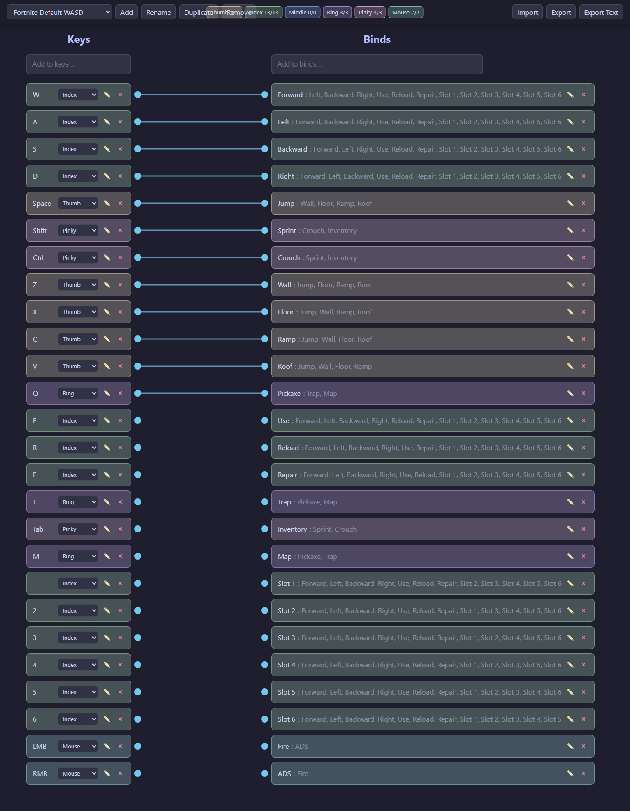
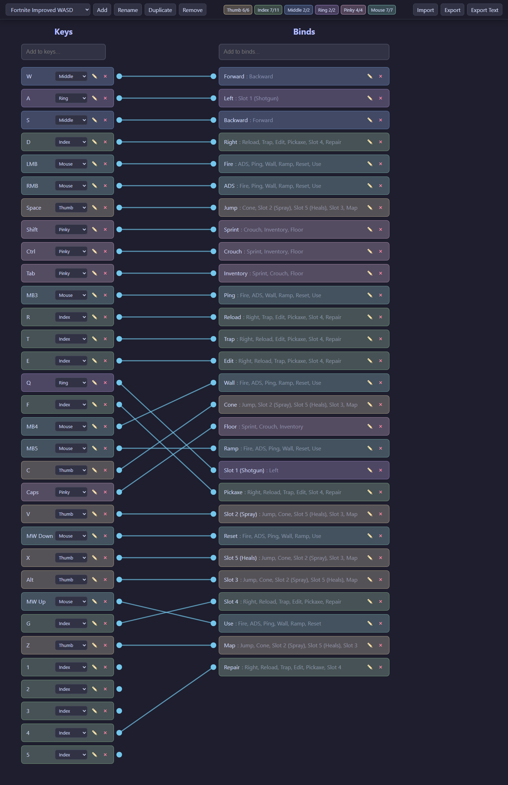
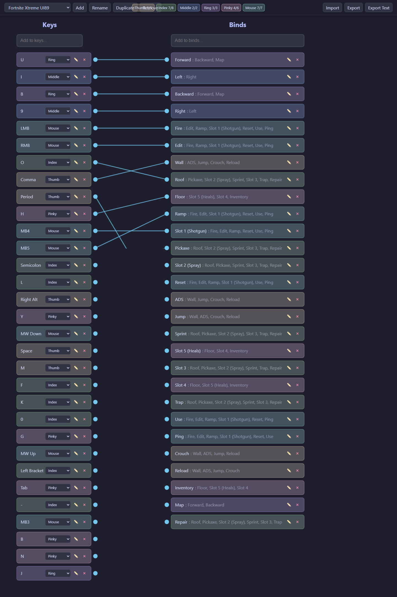

# Key Mesh

Key Mesh helps you plan keyboard and mouse binds for games before you lock them in inside a title’s settings. You map **keys** on one side to **actions** on the other, tag which finger uses each key, and draw connections between them so overlaps and awkward combos are easy to see—then you can iterate toward something that fits your hands and personal constraints.

It’s useful whenever you want a clear picture of your layout: competitive binds, alternate movement keys, or experimenting with “improved” setups without losing track of what conflicts with what. **Live site:** [rithamnatani.github.io/keymesh](https://rithamnatani.github.io/keymesh/)

### Fortnite Default WASD

### Fortnite Improved WASD

### Fortnite Xtreme UI89

