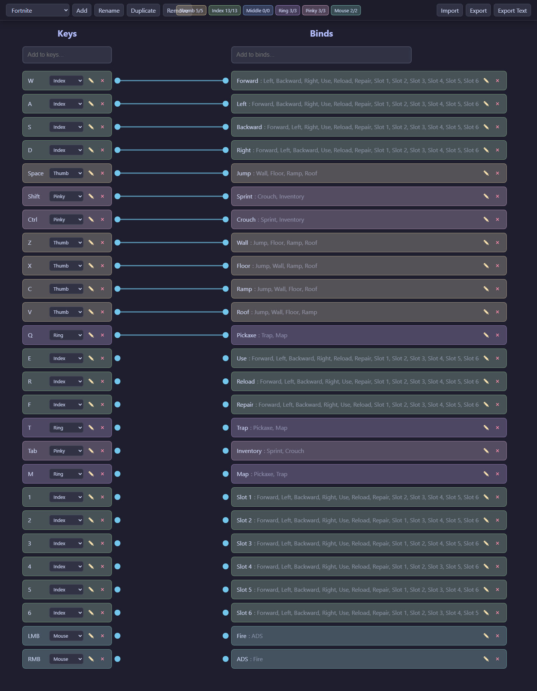
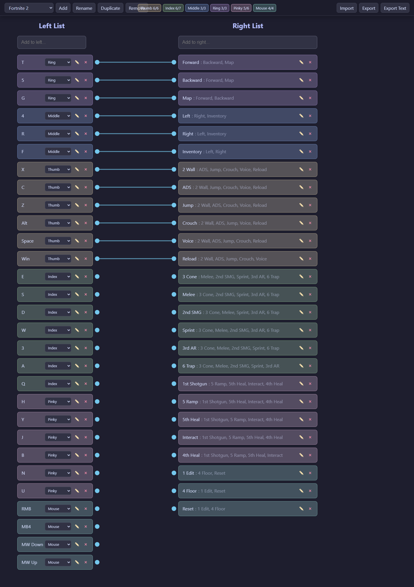

# Connected Lists

Small web app for laying out **keys** on the left, **actions** on the right, optional **finger** tags, and draggable **connections** between them. Useful for visualizing game binds or keyboard layouts.

## Live demo

[GitHub Pages site](https://rithamnatani.github.io/list/)

On a first visit (empty saved data), the app loads two built-in examples from `examples/`: **Fortnite** (generic default-style binds) and **Fortnite 2** (a fuller layout exported from the app).

## Example previews

Colored bars next to keys match finger colors inside the app.

### Fortnite (default-style binds)



### Fortnite 2



## Run locally

Use any static server so `fetch` can load `examples/*.json` (opening the file directly as `file://` skips those loads).

```bash
bun install
bun run serve
```

Then open [http://127.0.0.1:3000/](http://127.0.0.1:3000/) (set `PORT` to use another port).

## Regenerate README images

Preview PNGs are produced from the same JSON files as the app using [Sharp](https://sharp.pixelplumbing.com/) (no browser needed):

```bash
bun install
bun run readme-previews
```

Optional: **real** viewport screenshots via Playwright (needs a working Chromium install):

```bash
bun x playwright install chromium
bun run screenshots
```

If `playwright` hangs on launch in your environment, stick with `readme-previews`.
